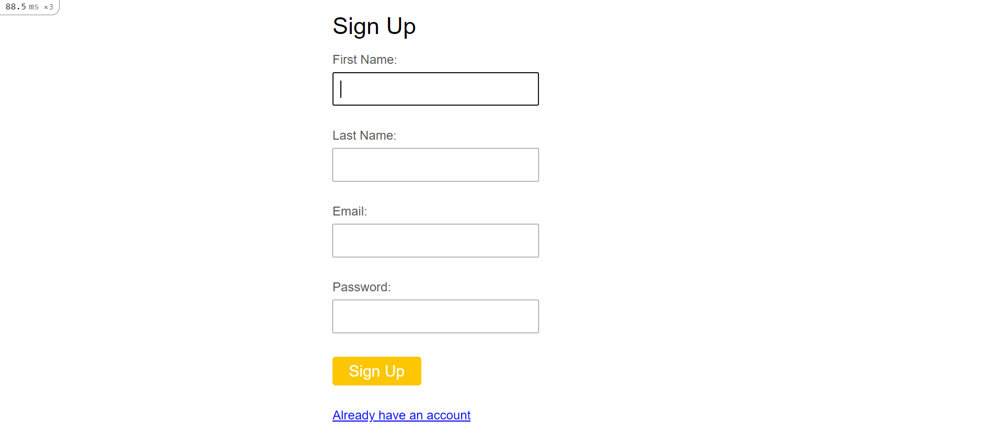
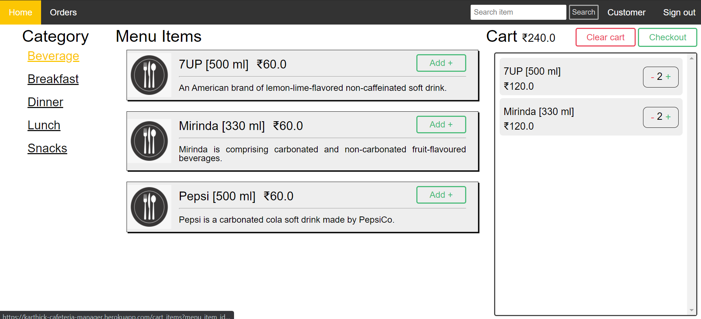
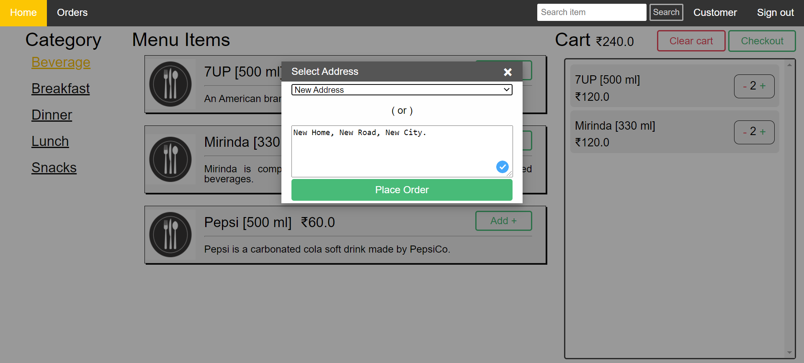
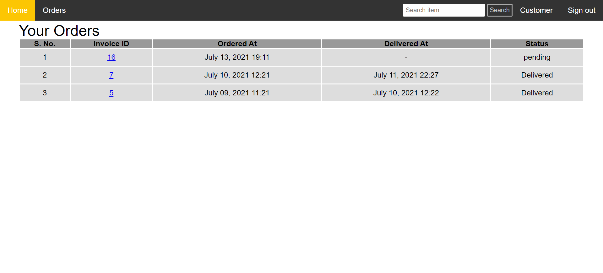
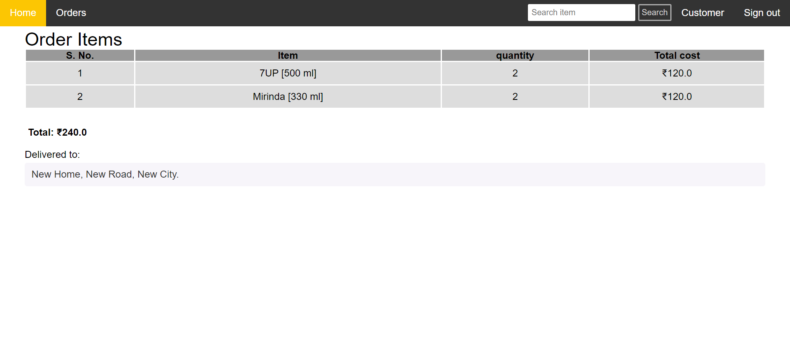
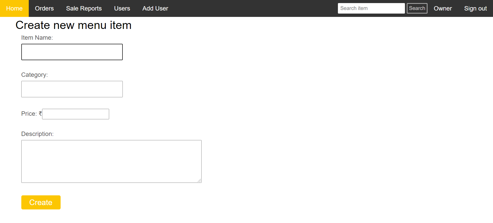
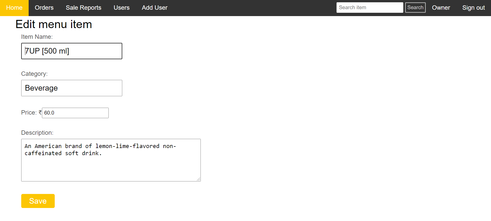
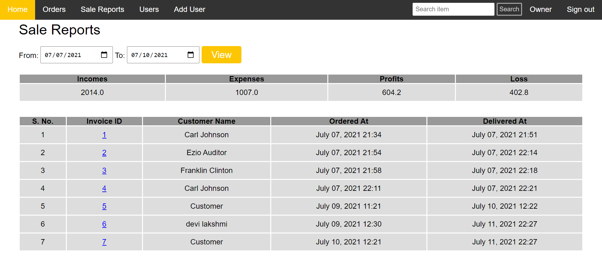

# Cafeteria Management System

Go and look around this web application [Cafeteria Manager](http://karthick-cafeteria-manager.herokuapp.com/)

- demo customer (email: 'customer@gmail.com' and password: 'customer')
- demo billing clerk (email: 'clerk@gmail.com' and password: 'clerk')
- demo owner (email: 'owner@gmail.com' and password: 'owner')

Every user should sign-in.

## Customer

Customer only can sign up as a new user.

In main page, customer can buy foods by clicking on the 'Add +' button.

Then the item added to the cart.
Customer can add or reduce quantity by clicking the '+' and '-' buttons.

The cart items will clear when the customer clicks 'Clear Cart' button.
It asks address when the customer clicks 'Checkout' button.
The customer should select 'New Address' in the select field then the customer should type address.

The main page redirect to orders page when the customer clicks 'Place Order' button.

The customer can view ordered items by clicking the invoice ID.
In this page, the customer is able to see items that ordered by himself and Total amount.

The New Address should be stored.

Then the customer can choose that address in next order or even he can create another one.

## Billing Clerk

Billing Clerk Main Page.

Clerk should order items for Walk-In Customer.

The Clerk can set customers orders as delivered by clicking "Set Delivered".

## Owner

Owner Main Page. The owner has power to use all things.

The owner should be able to create new menu item by clicking on the "Add Item" button.

The owner can edit particular menu item.

The owner can close or open menu categories.
The owner can set available or unavailable for menu items.

The owner has power to create Billing Clerk and another Owner but not Customer.

The owner can see all users details.

The owner can see all customers orders and set as delivered.

The owne can see all Sale Reports.

The owner can see particular range of dates sale reports.

